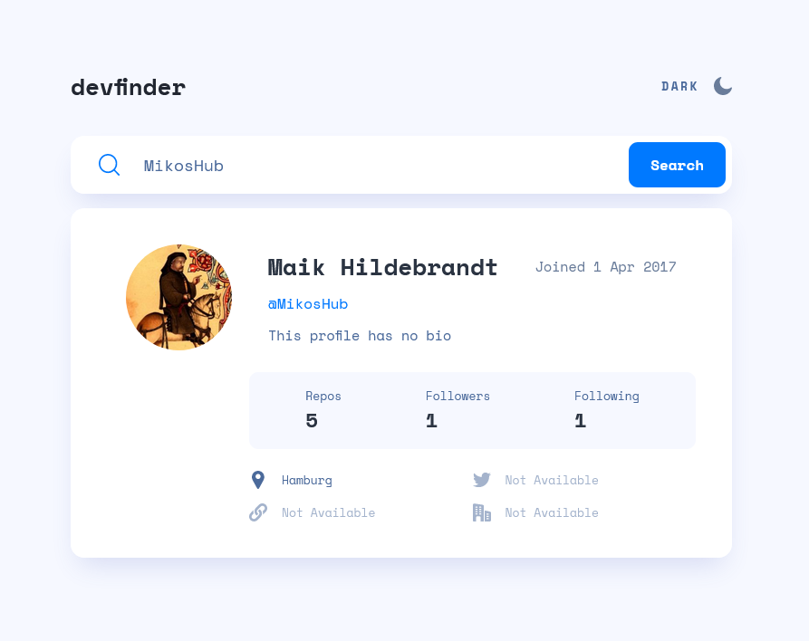

# Frontend Mentor - GitHub User Search solution

My solution to the [GitHub user search app challenge on Frontend Mentor](https://www.frontendmentor.io/challenges/github-user-search-app-Q09YOgaH6). 

### Total Work Time
~ 4 hours

### Built with

- HTML5
- CSS
- jQuery
- Mobile-first workflow

### Screenshots

