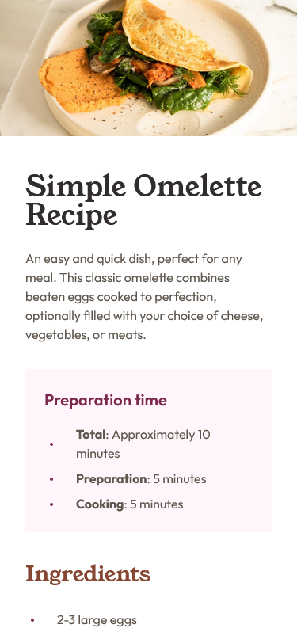
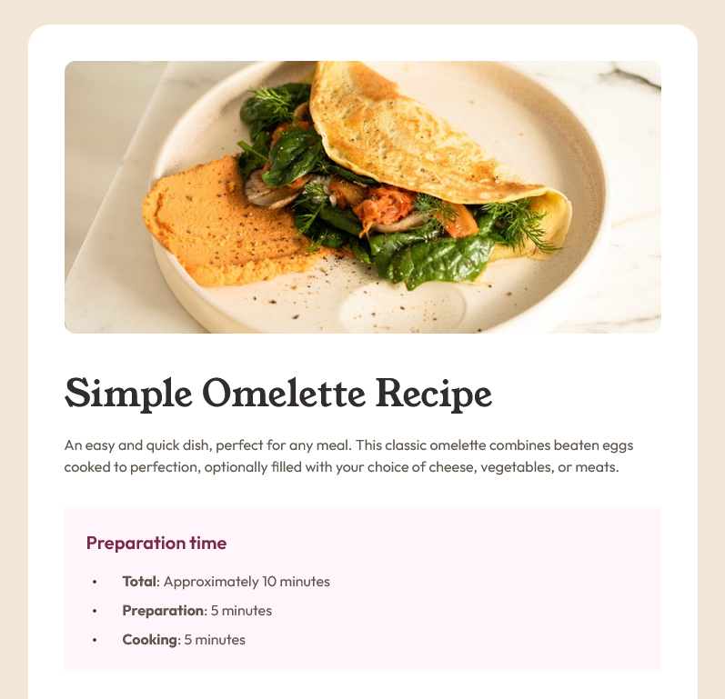

# Frontend Mentor - Recipe page solution

My solution to the [Recipe page challenge on Frontend Mentor](https://www.frontendmentor.io/challenges/recipe-page-KiTsR8QQKm). 

### Total Work Time
~ 2 hours

### Built with

- HTML5
- CSS
- Mobile-first workflow

### Screenshots

